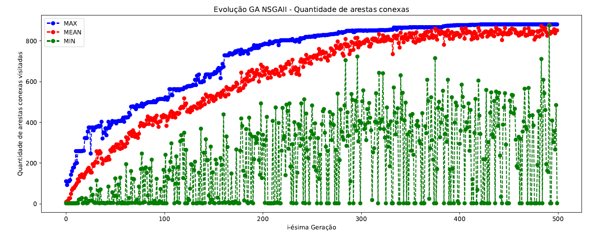
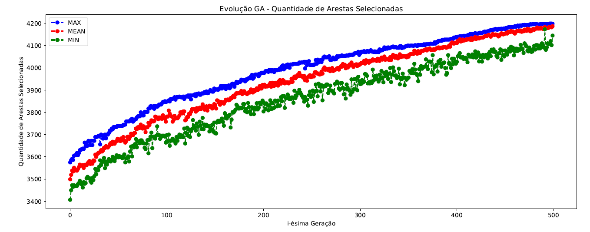

# Contato E-mail: felipekian@yahoo.com.br

# MAPEAMENTO AUTOMÁTICO DE ROTAS PARA VIA EXPRESSA DE ÔNIBUS : UMA ABORDAGEM COM ALGORITMOS EVOLUTIVOS COM ÊNFASE NA CIDADE DE BOA VISTA RR

## COMO EXECUTAR O PROJETO

 * Precisa instalar o **Anaconda** Python 3 -> https://www.anaconda.com/distribution/
 * Precisa instalar a lib **DEAP** -> https://deap.readthedocs.io/en/master/
 * Precisa instalar a lib **OSMnx** -> https://osmnx.readthedocs.io/en/stable/
 * Escolher uma das implementações:
    * Com **AG onemax (experimento I)**
    * Com **AG onemax + DFS (experimento II)**
    * Com **AG NSGA-II 3 obj (experimento III)**
    * Com **AG NSGA-II 5 obj (experimento IV)**

# EXECUÇÃO DE COMPARAÇÃO DOS MÉTODOS IMPLEMENTADOS

* **500 Gerações**
* **50 Cromossomos**

## PARA MAIS DETALHES CONFIRA O ARTIGO E O TCC ( NA PASTA  TCC E ARTIGO )

# ARQUITETURA PROPOSTA

# MAPA COMPLETO E COM TRATAMENTO

# RESULTADO EXPERIMENTO I - ONEMAX

* Rota 1 - 13 Arestas:
    * 1ª - Avenida Amazonas
    * 2ª - Avenida Glaycon de Paiva
    * 3ª - Rua Araújo Filho
    * 4ª - Avenida Capitão Ene Garcez
    * 5ª - Rua Coronel Pinto
    * 6ª - Avenida Capitão Júlio Bezerra
    * 7ª - Avenida Amazonas

# RESULTADO EXPERIMENTO II - ONEMAX + DFS

* Rota 5 - 38 Arestas:
    * 1ª - Avenida Amazonas
    * 2ª - Avenida Mário Homem de Melo
    * 3ª - Rua Ajuricaba
    * 4ª - Rua Dom Pedro I
    * 5ª - Rua Cerejo Cruz
    * 6ª - Avenida Terêncio Lima
    * 7ª - Avenida Major Williams
    * 8ª - Rua Valério Magalhães
    * 9ª - Rua Coronel Mota
    * 10ª - Rua Professor Agnelo Bitencourt
    * 11ª - Rua Alfredo Cruz
    * 12ª - Avenida Capitão Júlio Bezerra
    * 13ª - Rua Coronel Pinto
    * 14ª - Avenida Ville Roy
    * 15ª - Avenida Amazonas

# RESULTADO EXPERIMENTO III - NSGA-II COM 3 OBJETIVOS 

* Rota 10 - 46 Arestas:
     * Avenida Amazonas
     * Avenida Ville Roy
     * Rua Araújo Filho
     * Avenida Capitão Ene Garcez
     * Avenida Capitão Ene Garcêz
     * Rua Alfredo Cruz
     * Rua Professor Agnelo Bitencourt
     * Avenida Major Williams
     * Avenida Nossa Senhora da Consolata
     * Rua Barão do Rio Branco
     * Rua Coronel Mota
     * Avenida Amazonas

# RESULTADO EXPERIMENTO IV - NSGA-II COM 5 OBJETIVOS

* Rota 40 - 120 Arestas:
    * Avenida Amazonas
    * Avenida Ville Roy
    * Rua Araújo Filho
    * Avenida Glaycon de Paiva
    * Rua Ajuricaba
    * Rua Cecília Brasil
    * Rua Professor Diomedes Souto Maior
    * Rua Cerejo Cruz
    * Avenida Nossa Senhora da Consolata
    * Avenida Presidente Castelo Branco
    * Avenida Terêncio Lima
    * Rua Dom Pedro I
    * Avenida Capitão Ene Garcês
    * Avenida Forte São Joaquim
    * Rua Major Manoel Correia
    * Avenida Major Williams
    * Rua Valério Magalhães
    * Rua Coronel Mota
    * Rua Barão do Rio Branco
    * Rua Professor Agnelo Bitencourt
    * Avenida Benjamin Constant
    * Rua Coronel Pinto
    * Rua Alfredo Cruz
    * Avenida Amazonas
    
    
# VISÃO GERAL DAS RODADAS EXPERIMENTAIS

**LADO A LADO DA ÚLTIMA RODADA (RESULTADOS MOSTRADOS ACIMA)**

**LADO A LADO TODAS AS RODADAS EXPERIMENTAIS**

# OBRIGADO POR PRESTIGIAR ESTUDO TRABALHO

# CONTADO E-mail: felipekian@yahoo.com.br
